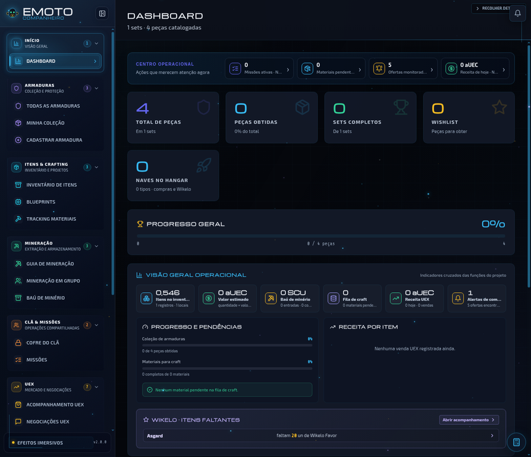
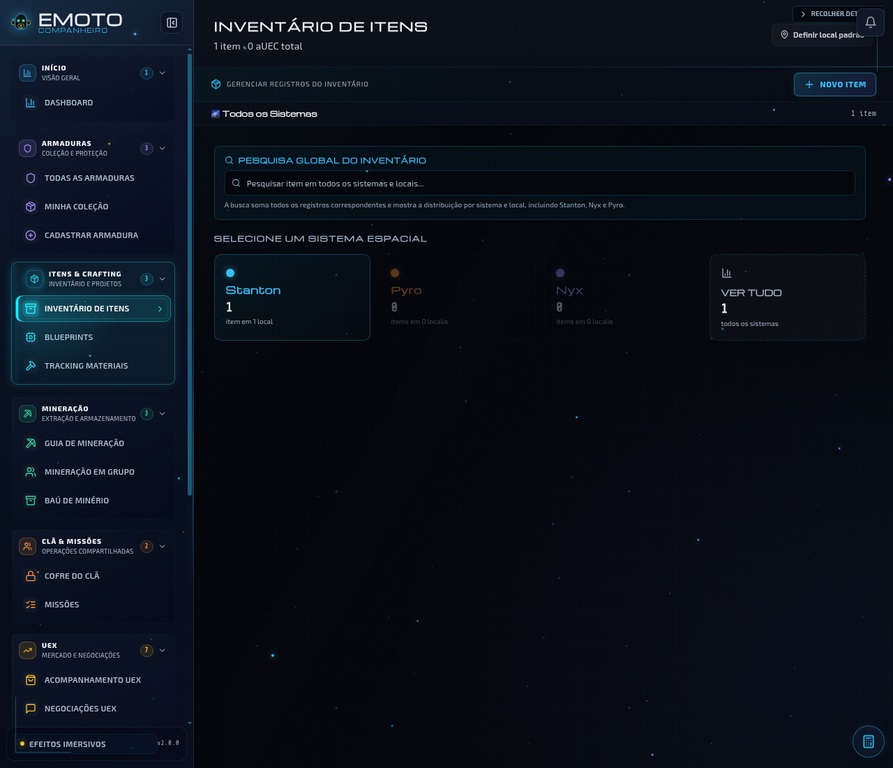
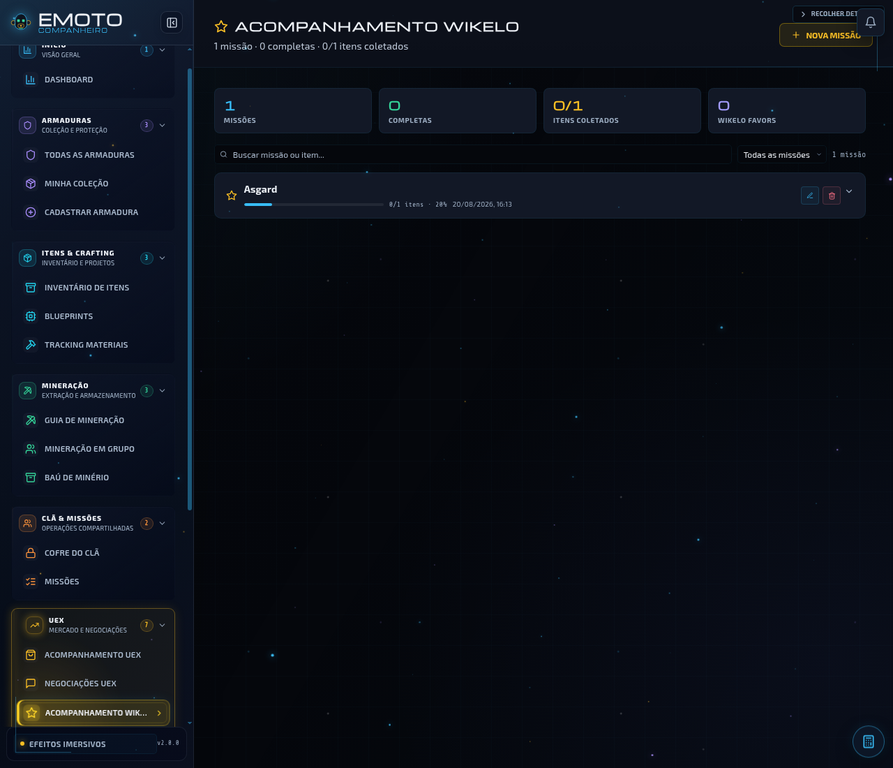
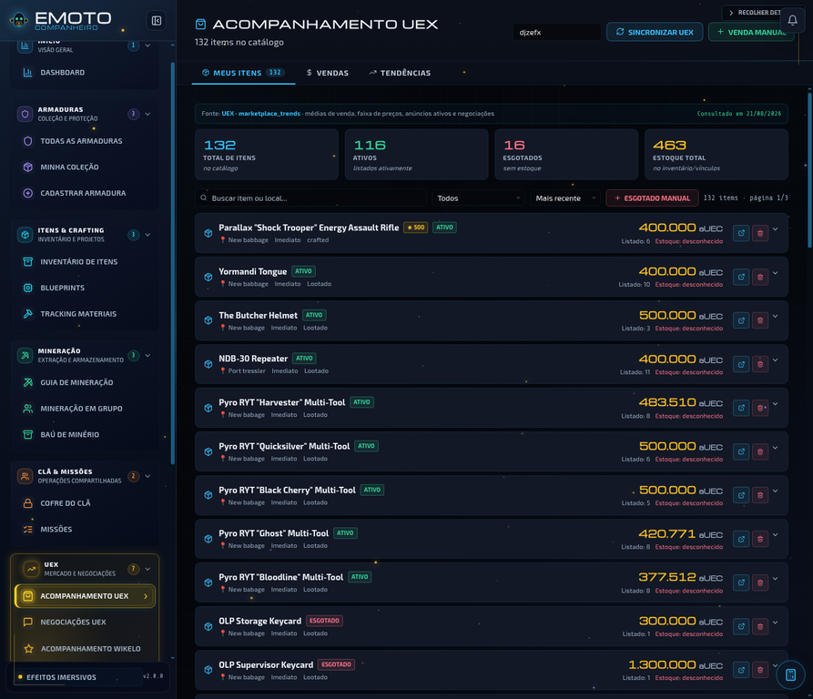

# Companheiro Emoto

> **Seu centro de operações para Star Citizen.** Organize armaduras, inventário, blueprints, mineração, missões, Wikelo, negociações e marketplace UEX em um aplicativo desktop moderno para Windows.



## Sobre o projeto

O **Companheiro Emoto** é uma ferramenta pessoal para jogadores de *Star Citizen* que precisam acompanhar muitos itens, armaduras, missões, recursos e operações de comércio sem depender de várias planilhas ou anotações separadas.

A aplicação combina uma interface React com Electron, armazenamento local e integração com a UEX. O objetivo é transformar informações espalhadas em uma visão operacional simples: saber o que você possui, onde está guardado, o que falta para um craft, quais missões estão ativas e quais anúncios precisam de atenção.

> O projeto é um aplicativo de apoio e organização. Ele não controla o jogo, não compra itens automaticamente e não substitui os serviços oficiais ou o site da UEX.

## O que você pode fazer

| Módulo | Principais recursos |
|---|---|
| **Dashboard** | Resumo de armaduras, inventário, materiais, missões, receita UEX, Wikelo, alertas e hangar. |
| **Armaduras** | Catálogo, variantes, peças, posse, wishlist, quantidades, duplicidades e sets completos. |
| **Inventário de Itens** | Quantidades, locais, imagens, reservas, preço médio, transferência, pesquisa global e local padrão. |
| **Blueprints** | Filtros por categoria, classe, minério, tipo e subtipo; posse, wishlist e fila de crafting. |
| **Tracking de Materiais** | Materiais necessários, qualidade mínima, coleta SCU/cSCU, prioridade e consumo seguro do Baú de Minério. |
| **Mineração** | Builds, equipamentos, sessões de mineração em grupo, refino, loot e armazenamento. |
| **Missões** | Missões manuais e automáticas, leitura do Game.log, recompensas, estatísticas e distribuição de loot. |
| **Wikelo** | Missões, escaneamento do inventário, itens repetidos entre missões e entrega transacional. |
| **UEX** | Sincronização de anúncios, importação em lote, estoque interno, negociações, chat e vendas. |
| **Inteligência UEX** | Busca de itens, preços, histórico, análise de lucro, oportunidades e Alertas de Compra. |
| **Sistema** | Backup, restauração, pasta de dados, limpeza seletiva, notas, locais, categorias e links úteis. |

## Principais destaques

### Organização visual em um único painel

A Dashboard reúne os indicadores mais importantes e cria atalhos para as telas que precisam de atenção. O jogador pode começar pelo resumo e abrir diretamente a pendência correspondente.

### Controle de armaduras por variante e peça

A coleção permite registrar quantas unidades de cada peça você possui, identificar sets completos e vincular unidades ao estoque interno da UEX. A pesquisa e os agrupamentos foram pensados para bases grandes.

### Inventário com localização e pesquisa global

Pesquise um item e veja a quantidade total distribuída por sistema e local. O cadastro pode usar sugestões da UEX, receber imagem, indicar reserva para outra pessoa e ser transferido sem perder a miniatura vinculada.



### Wikelo com cálculo de scrip

O Acompanhamento Wikelo mostra o progresso de cada missão e permite escanear o inventário sem consumir itens. Para **Wikelo Favor**, a ferramenta aplica a regra:

> **1 Wikelo Favor = 50 scrip.**

O cálculo soma **MG Scrip**, **Council Scrip** e **ConCuI Scrip** cadastrados no Inventário de Itens e informa quanto ainda falta, sem remover o saldo durante a consulta.



### UEX com sincronização e importação em lote

Informe seu nick da UEX, sincronize os anúncios e use filtros por status, nome, preço, estoque e validade. A função **Adicionar em lote** evita a necessidade de clicar em dezenas ou centenas de anúncios individualmente e ignora registros já existentes.



### Alertas e negociações

Crie regras para acompanhar itens e ofertas. O sininho abre o grupo correspondente uma única vez, enquanto a tela de negociações mantém o chat organizado, com filtros, tradução, verificação de anúncios, conclusão de vendas e links para a UEX e Spectrum.

### Desempenho para bases grandes

O projeto possui atualizações seletivas na Minha Coleção e índices reutilizáveis no Acompanhamento UEX. Essas estratégias reduzem o trabalho repetido ao atualizar uma peça, sincronizar anúncios ou reabrir uma tela com muitos registros.

## Capturas rápidas

| Dashboard | Inventário |
|---|---|
|  |  |

| Wikelo | Acompanhamento UEX |
|---|---|
|  |  |

## Tecnologia

| Camada | Tecnologia |
|---|---|
| Interface | React 18 |
| Aplicativo desktop | Electron 43 |
| Persistência relacional | SQLite em memória com sql.js |
| Persistência leve | localStorage para módulos e preferências |
| Efeitos visuais | PixiJS 8, GSAP e componentes locais de microinteração |
| Ícones | Lucide React |
| Empacotamento | electron-builder para Windows |

O projeto usa `contextIsolation`, `contextBridge` e `nodeIntegration: false` para manter uma ponte controlada entre a interface e o processo principal do Electron.

## Instalação rápida para desenvolvimento

### Requisitos

É necessário ter **Node.js 18 ou superior**, npm e Windows para executar o aplicativo empacotado. Para desenvolvimento, o renderer também pode ser executado em outros sistemas compatíveis com Node.

```bash
git clone https://github.com/MesopotamiaAlpha/projetoStarCitizenElectron.git
cd projetoStarCitizenElectron
npm install
npm run dev
```

O comando `npm run dev` inicia o React em `http://localhost:3000` e abre o Electron em modo de desenvolvimento.

### Gerar a versão Windows

```bash
npm run build
```

O instalador NSIS e o arquivo ZIP são gerados na pasta `dist/`.

## Primeira utilização

Ao iniciar o programa, escolha a pasta de dados em **Sistema → Diretório de Dados** e crie um backup em **Sistema → Backup & Restauração**. Depois, se utilizar os recursos UEX, configure o token na tela **UEX API (Live)** e sincronize o catálogo.

Um fluxo recomendado é começar pelo Inventário, cadastrar os locais principais, revisar a coleção de armaduras e então ativar os módulos de Missões, Wikelo e UEX conforme a necessidade.

## Documentação

| Documento | Finalidade |
|---|---|
| [Manual do Programador](MANUAL-DO-PROGRAMADOR.md) | Arquitetura, estrutura, contratos IPC, persistência, eventos, testes, desempenho e manutenção. |
| [Manual do Usuário](Manual%20Usu%C3%A1rio%20%E2%80%94%20Companheiro%20Emoto.md) | Guia detalhado para utilizar as telas e os fluxos do aplicativo. |
| [Manual do Usuário em PDF](Manual%20do%20Usu%C3%A1rio%20%E2%80%94%20Companheiro%20Emoto.pdf) | Versão ilustrada com capturas e exemplos passo a passo. |
| [Guia de instalação de arquivos](docs/GUIA-INSTALACAO-ARQUIVOS-2.0.0.md) | Orientações para substituir arquivos de correção e atualização. |
| [Guia de Limpeza Seletiva](docs/GUIA-LIMPEZA-SELETIVA-2026-08-20.md) | Explicação do backup e da limpeza por módulo. |

## Testes e validação

Para executar a verificação completa:

```bash
npm run verify
```

O comando executa os testes React, os testes Electron, o build de produção e a checagem sintática dos arquivos do processo principal.

## Estado do projeto

A versão atual é **2.0.0**. O projeto está em evolução contínua e prioriza organização de dados, desempenho em bases grandes, clareza visual e segurança da persistência local.

Sugestões, correções e melhorias podem ser registradas no [repositório do GitHub](https://github.com/MesopotamiaAlpha/projetoStarCitizenElectron).

## Referências

[1]: https://www.electronjs.org/docs/latest/tutorial/security "Electron Security"
[2]: https://github.com/sql-js/sql.js "sql.js"
[3]: https://www.electron.build/ "electron-builder"
